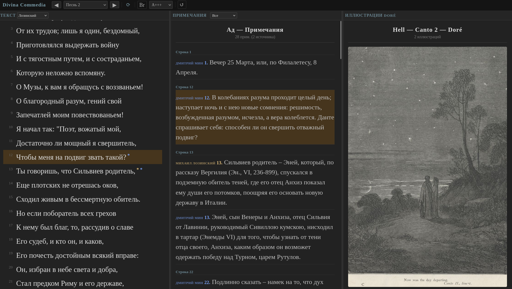
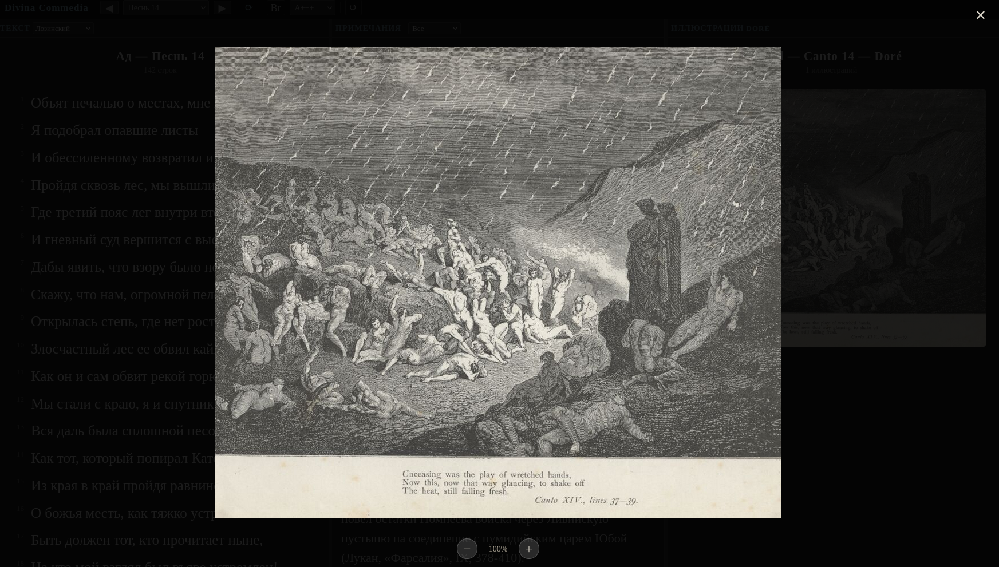
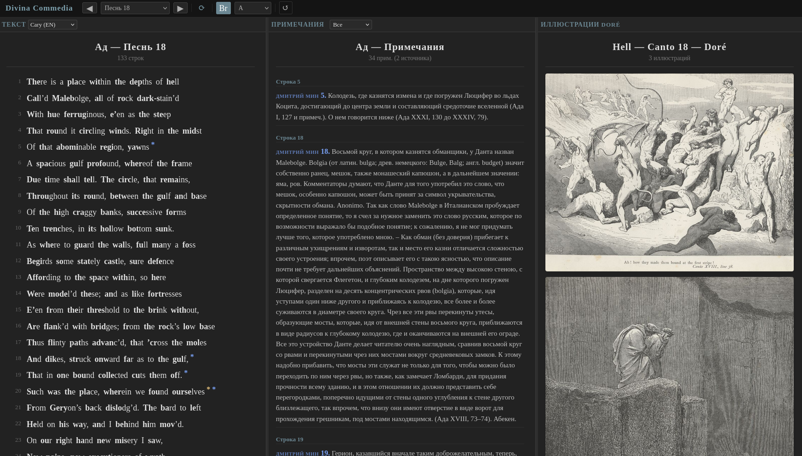

# Divina Commedia

Читалка «Божественной комедии» Данте — три панели: текст, примечания и гравюры Доре.

Открыть **dante.html** — без установки, без сервера, просто в браузере.

## Что внутри

| Панель | Содержание |
|--------|-----------|
| **Текст** | Лозинский · Мин · Cary (EN) · итальянский оригинал |
| **Примечания** | Все комментарии вместе, с цветовой кодировкой по источнику, сортировка по строкам |
| **Иллюстрации** | 136 гравюр Гюстава Доре |

Клик на ★ в тексте → примечания прокручиваются к строке.  
Клик на примечание → текст прокручивается к строке.

Все четыре перевода, все 100 песней, 2600+ редакторских примечаний, 136 иллюстраций.  
Без интернета, без сервера, без зависимостей — один HTML-файл и папка с картинками.

---

## Быстрый старт

Открой `dante.html` в браузере. Папка `illustrations/` должна быть рядом.

Работает офлайн, без сервера, без зависимостей.

---

## Общественное достояние

Весь контент свободен от авторских прав:

| Произведение | Автор | Год | Статус |
|-------------|-------|-----|--------|
| *Divina Commedia* | Данте Алигьери | 1321 | Общественное достояние |
| Русский перевод | Михаил Лозинский | ум. 1955 | Общественное достояние (2026) |
| Русский перевод (Ад) | Михаил Мин | — | Общественное достояние |
| Английский перевод | Henry Francis Cary | ум. 1844 | Общественное достояние |
| Иллюстрации | Гюстав Доре | ум. 1883 | Общественное достояние |

---

## Лицензия

Код — MIT. Контент — общественное достояние, делайте что хотите.
